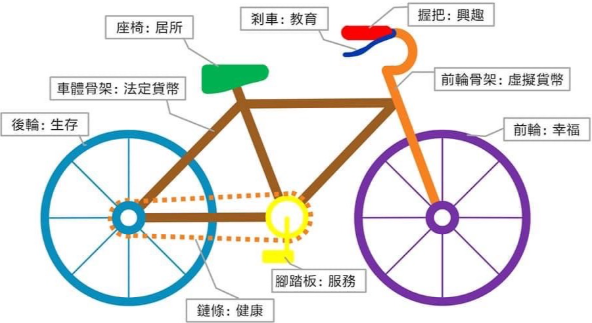

<!-- Copilot: html 圖旁邊文字方塊 -->

  
  

    <!-- 這是圖片旁邊的文字方塊，可以放任何內容。你可以透過 `margin-right` 設定圖片與文字之間的間距。-->
    
This is a story of four friends. They are actually one with four bodies. Running a coffee shop is the target if there is any.

  

<h1 style="text-align: center;">樂趣自行車</h1>

  

---
 
我走上街，人行道上有一個深洞，我掉了進去。我迷失了 … 我絕望了。
這不是我的錯，費了好大的勁才爬出來。

我走上同一條街，人行道上有一個深洞，我假裝沒看到，還是掉了進去。我不能相信我居會掉在同樣的地方。但這不是我的錯。還是花了很長的時間才爬出來。

我走上同一條街，人行道上有一個深洞，我看到它在那兒，但還是掉了進去 … 這是一種習氣。我的眼睛張開著，我知道我在那兒。這是我的錯。我立刻爬了出來。

我走上同一條街，人行道上有一個深洞，我繞道而過。

我走上另一條街。

＜人生五章＞，節錄自「西藏生死書」

Lama laughed a lot. Since we all experienced …

# 鐵塔咖啡 café51

